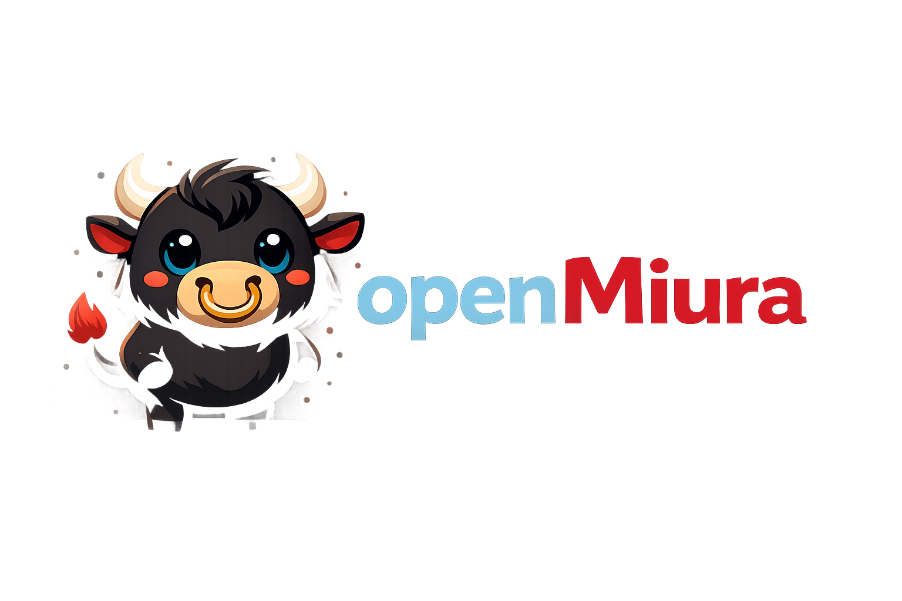

<p align="center">
  
</p>

<h1 align="center">openMiura</h1>

<p align="center">
  Governed agent operations platform for secure, auditable, multi-agent workflows
</p>

<p align="center">
  Local-first • Multi-tenant • Policy-driven • Auditable • Extensible
</p>

# openMiura

openMiura is a **governed agent operations platform** for teams that need more than a chat interface. It is designed to operate AI agents under explicit control: with multi-tenant segregation, policy enforcement, approvals, audit trails, release governance, evaluation gates, canary routing, operational voice flows, mobile/PWA surfaces, and a live canvas for monitoring and collaboration.

The project evolved across **nine implementation phases**. The current repository is the consolidated baseline that brings together the foundations, enterprise controls, operational surfaces, packaging, and hardening work completed across those phases.

## What openMiura is

openMiura sits between models, tools, channels, operators, and governed runtime policies. Instead of optimizing only for assistant-style conversation, it focuses on **agent operations**:

- **governed execution** of agents, tools, workflows, and operational actions
- **tenant / workspace / environment isolation**
- **RBAC, policy engine, approvals, and audit-first design**
- **releases, promotions, rollbacks, evaluation gates, and canary routing**
- **voice runtime** with confirmations for sensitive actions
- **PWA and operator surfaces** for on-the-go operations
- **live operational canvas** with overlays, collaboration, snapshots, and inspection
- **reproducible packaging and CI/CD support**

## What the repository includes

This repository contains the integrated codebase produced through phases 1–9:

- **Phase 1** — architecture foundation, broker/API contracts, policies, extensibility baseline
- **Phase 2** — multi-tenancy, workspaces, OIDC/SSO groundwork, fine-grained RBAC, segregation
- **Phase 3** — workflows, approvals, scheduling, playbooks, realtime operational flows
- **Phase 4** — secret broker patterns, policy hardening, sandboxing, compliance-oriented controls
- **Phase 5** — evaluation harness, scorecards, cost governance, decision tracing and explainability
- **Phase 6** — extension SDK, registry patterns, signing and developer experience improvements
- **Phase 7** — workflow builder, policy explorer, replay/compare, operator console
- **Phase 8** — release governance, voice/PWA, live canvas, collaboration, packaging foundations
- **Phase 9** — operational hardening: real audio pipeline baseline, percentage canary routing, reproducible packaging

## Core capabilities

### 1. Governance and release operations
- release bundles, bundle items, approvals, promotions, rollbacks, and environment snapshots
- evaluation gates for quality, cost, latency, and policy adherence
- change intelligence and release summaries
- canary state, activation, percentage routing, and routing observations

### 2. Runtime and control plane
- HTTP API and admin endpoints
- broker interfaces for governed runtime access
- policy-aware tool execution and confirmation flows
- audit logging, replay data, and operational traceability

### 3. Voice, mobile, and operator experience
- voice sessions, transcripts, outputs, and command lifecycle
- local voice asset pipeline with provider abstraction hooks
- PWA/mobile operational mode with notifications and secure deep links
- operator console for runtime administration and oversight

### 4. Live operations canvas
- persisted canvas documents, nodes, edges, views, and presence
- overlays for approvals, failures, cost, traces, policies, and secrets exposure controls
- comments, snapshots, compare views, and shared operational context

### 5. Security and enterprise controls
- multi-tenant segregation by tenant, workspace, and environment
- role-based access control and policy enforcement
- secret redaction and governance hooks
- hardened limits for voice, canvas, and HTTP surfaces

### 6. Developer experience and packaging
- migrations and automated validation
- extension SDK and registry foundations
- reproducible packaging artifacts and release workflows
- quickstarts, operational docs, and runbooks

## High-level architecture

```text
Channels / UI / PWA / Voice / Canvas
                |
        HTTP API / Broker / Admin
                |
        Application services layer
                |
 Policies / approvals / routing / audit
                |
 Persistence / registries / artifacts
```

## Repository structure

```text
.
├── app.py
├── configs/                 # YAML configuration and runtime policy definitions
├── docs/                    # architecture, operations, phases, quickstarts, runbooks
├── docker/                  # container entrypoints and deployment helpers
├── openmiura/
│   ├── agents/              # agent routing and agent-specific logic
│   ├── application/         # services for releases, voice, pwa, canvas, packaging, etc.
│   ├── builtin_skills/      # bundled skills and built-in capability definitions
│   ├── channels/            # channel adapters (Telegram, Slack, Discord, ...)
│   ├── core/                # config, schema, audit, memory, auth, security primitives
│   ├── endpoints/           # HTTP endpoint composition
│   ├── extensions/          # SDK, loader, registry, scaffolding
│   ├── infrastructure/      # persistence and supporting infra services
│   ├── interfaces/          # HTTP, broker and admin route surfaces
│   ├── tools/               # tool implementations and execution controls
│   ├── ui/                  # browser UI / operator surface assets
│   └── workers/             # background and channel workers
├── ops/                     # observability assets (Prometheus / Grafana / Alertmanager)
├── packaging/               # desktop/mobile packaging scaffolds
├── scripts/                 # operational and maintenance scripts
├── skills/                  # user/project-defined skills
└── tests/                   # integration and unit tests
```

## Supported deployment posture

openMiura is designed to run **local-first** or in controlled infrastructure. A common baseline is:

- FastAPI application behind a reverse proxy
- local SQLite for baseline operation or external database where appropriate
- Ollama-compatible local model endpoints by default
- separate workers for Telegram/Slack/Discord when enabled
- admin and broker endpoints protected by tokens, auth, and policy controls

## Quickstart

### 1. Create and activate a virtual environment

```bash
python -m venv .venv
source .venv/bin/activate
```

Windows PowerShell:

```powershell
python -m venv .venv
.\.venv\Scripts\Activate.ps1
```

### 2. Install dependencies

```bash
pip install -e .[dev]
```

or, if you prefer requirements:

```bash
pip install -r requirements.txt
```

### 3. Prepare configuration

Copy the example environment file and adjust only the variables you need:

```bash
cp .env.example .env
```

The default runtime configuration file is:

```text
configs/openmiura.yaml
```

### 4. Run the application

```bash
python -m openmiura run --config configs/openmiura.yaml
```

You can also run the FastAPI app directly:

```bash
uvicorn app:app --host 127.0.0.1 --port 8081 --reload
```

### 5. Optional workers

Telegram polling:

```bash
python scripts/telegram_poll_worker.py
```

Discord worker:

```bash
python scripts/discord_worker.py
```

### 6. Environment health check

```bash
python -m openmiura doctor --config configs/openmiura.yaml
```

## Validation

Typical validation flow:

```bash
python -m compileall -q app.py openmiura tests
pytest --collect-only -q
pytest -q tests/unit
```

Optional UI syntax validation:

```bash
node --check openmiura/ui/static/app.js
```

## Security model

openMiura assumes an enterprise-style control model:

- tenant/workspace/environment segregation
- approvals for sensitive operations
- release governance and promotion evidence
- audit logging for sensitive runtime actions
- policy enforcement at channel, tool, and control-plane boundaries
- secrets kept outside the repository and injected at runtime

Before running openMiura outside a local sandbox, read [SECURITY.md](SECURITY.md).

## Public repository hygiene

This public-ready bundle excludes generated caches, local runtime artifacts, embedded audio samples, and VCS metadata. Do **not** commit:

- `.env`
- real admin, broker, channel, or provider tokens
- local databases and backups
- generated voice assets
- local sandbox outputs

## Recommended docs to read next

- [docs/installation.md](docs/installation.md)
- [docs/deployment.md](docs/deployment.md)
- [docs/security.md](docs/security.md)
- [docs/observability.md](docs/observability.md)
- [docs/backup_restore.md](docs/backup_restore.md)
- [docs/quickstarts/operator.md](docs/quickstarts/operator.md)
- [docs/quickstarts/admin.md](docs/quickstarts/admin.md)
- [docs/quickstarts/developer.md](docs/quickstarts/developer.md)

## Project status

The codebase is suitable for private collaboration and controlled deployments, and it now has a public-friendly repository structure. Production use still requires environment-specific decisions around:

- external identity integration and secret management
- real provider credentials for voice and model services
- infrastructure, reverse proxying, backups, and observability setup
- release promotion workflow and approval ownership

## License

Apache License 2.0. See [LICENSE](LICENSE).
