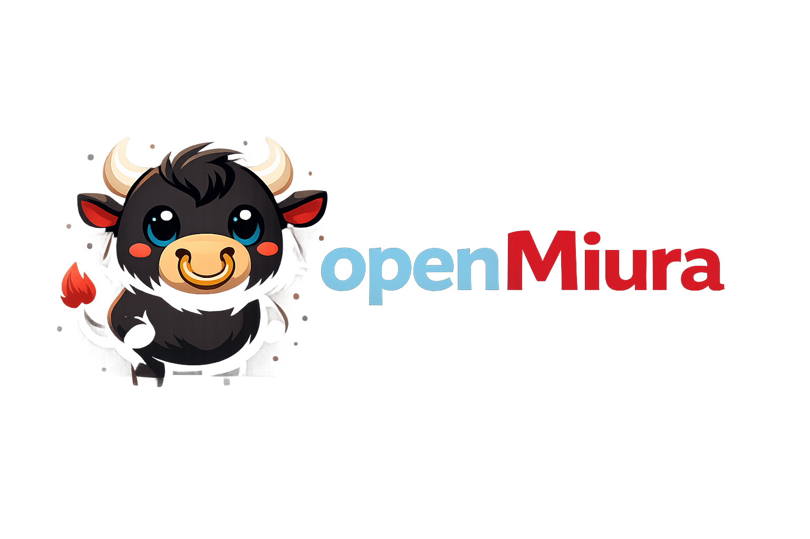

<p align="center">
  
</p>

<h1 align="center">openMiura</h1>

<p align="center">
  <em>Open governance plane for LLM agents in regulated scientific environments.</em>
</p>

<p align="center">
  <a href="https://github.com/fmarrabal/openmiura/actions/workflows/ci.yml"></a>
  <a href="https://github.com/fmarrabal/openmiura/actions/workflows/security.yml"></a>
  
  <a href="LICENSE"></a>
  
</p>

---

## What openMiura is

openMiura is an open-source **governance plane** that sits between an LLM-driven agent runtime and the systems it touches (chat channels, file stores, instrument data, lab notebooks). It does not run the agent — it **audits, gates, and signs** every action the agent takes, so a regulated laboratory (GxP / GMP / 21 CFR Part 11 / EU GMP Annex 11 / GAMP 5 / ALCOA+) can defend each decision years later.

The audit trail is itself the deliverable: every tool call, every secret read, every channel message resolves a policy decision, the decision is recorded with the inputs that produced it, and signed evidence packs link decisions to underlying records. Scope (`tenant / workspace / environment`) is enforced at the persistence layer so multi-context deployments stay isolated.

### Core primitives

| Primitive | Purpose |
|---|---|
| **Policy engine** | Declarative rules over actions and contexts; supports `tool / memory / secret / channel / approval` scopes. |
| **Approval gates** | Human-in-the-loop with signer, reason, meaning, and timestamp recorded on the audit trail. |
| **Evidence packs** | Signed exports linking decisions to underlying records, exported per scope window. |
| **Scope isolation** | `tenant / workspace / environment` partitioning enforced end-to-end. |
| **Identity links** | `(channel_user_key → global_user_key)` bridge so a person operating across Slack / Telegram / voice / web collapses to a single global principal. |
| **Adapter contracts** | Telegram, Slack, Discord channel adapters; MCP integration surface for tool brokering. |

## What openMiura is **not**

- **Not a chatbot** or a thin wrapper around a model API.
- **Not a replacement for an agent runtime** — it supervises one.
- **Not a certified compliance product.** It maps to regulatory controls (21 CFR Part 11, EU GMP Annex 11, GAMP 5, ALCOA+); certification remains the responsibility of the operating organisation.
- **Not stable.** Most components are `experimental`; a few are `beta`. None are marked `stable`.

---

## Highlights

- **3 fully-functional UIs at `/ui/v2/`** — `admin` (15 views), `science` (5 views), `interview` (3 views, offline demo). Tailwind v4 + Alpine.js, self-hosted, no Node runtime. Single Python deployable.
- **23 view surfaces in total**, each backed by a per-card `{state, data, error, raw}` state machine with a one-click raw-JSON inspector.
- **Audited write paths** with confirmation modals: recovery jobs, identity links, channel YAML save, secrets wizard save, compliance export, dispatch cancel/retry/reconcile, workflow actions, approval decisions, policy pack apply, portfolio evidence operations.
- **Real file upload** (`POST /science/uploads`) — content-addressed by SHA-256, 50 MiB cap, audit-recorded.
- **Per-channel test message** (`POST /admin/channels/{name}/test`) — sends a probe through the configured Slack / Telegram adapter and records both attempt and outcome.
- **SSE pseudo-streaming chat** (`POST /http/message/stream`) — `meta` / `heartbeat` / `chunk` / `done` event taxonomy, forward-compatible with future native LLM token streaming.
- **NMR mini-viewer** in the science UI — JCAMP-DX 5.01 1D-spectrum parser rendered inline as SVG, NMR axis convention honoured.
- **745 tests** in the suite, run on every PR across Python 3.10 / 3.11 / 3.12. The UI v2 layer alone has **123 regression tests** that pin endpoint surfaces, modal ids, state-machine shapes, and accessibility wiring.
- **CI gates**: stylesheet recompile-diff check, secret scan, dependency review, pip-audit, reproducible-package build.

---

## Quick start

```bash
# Clone + install
git clone https://github.com/fmarrabal/openmiura.git
cd openmiura
pip install -e .[dev]

# Verify configuration
openmiura doctor --config configs/openmiura.yaml

# Run the canonical end-to-end demo (produces a real audit trail
# with policy evaluation, human approval, signed release evidence
# and a reviewable canvas inspector)
python scripts/run_canonical_demo.py --output /tmp/demo.json

# Start the HTTP service
openmiura run --config configs/openmiura.yaml
# → http://127.0.0.1:8081
#   /health, /metrics, /ui/v2/admin.html, /ui/v2/science.html, ...
```

**Requirements**: Python ≥ 3.10. Tested on 3.10 / 3.11 / 3.12. SQLite (bundled) or PostgreSQL via the `postgres` extra.

---

## The three UIs

`openMiura` ships three independent UI profiles served at `/ui/v2/`. They share design tokens, the shell, auth + theme + components, but address distinct users.

### Admin console — `/ui/v2/admin.html`

For the operator / SRE who configures the platform. 15 functional views:

| Group | Views |
|---|---|
| **Operate** | Dashboard, Runtimes, Dispatches, Evidence packs, Portfolio evidence |
| **Govern** | Policies (+ apply pack), Approvals, Secrets governance, Identities & RBAC |
| **Configure** | Channels wizard, Secrets wizard, Workflows, System & config |
| **Debug** | Event log, Tool calls |

Each view consumes a well-defined subset of `/admin/*` endpoints, surfaces a per-card state machine, and gates every write behind a confirmation modal with an audit-trail reason field.

### Science workspace — `/ui/v2/science.html`

For the lab operator (chemist, biologist, NMR spectroscopist) who runs governed agent flows. 5 functional views:

| View | Endpoint | Notes |
|---|---|---|
| Chat with agent | `POST /http/message{,/stream}` | Streaming on by default with one-shot fallback. |
| Upload spectrum | `POST /science/uploads` | Drag-and-drop, SHA-256 in browser, content-addressed server storage. Inline JCAMP-DX mini-viewer for 1D NMR. |
| Review drafts | `GET /admin/operator/overview` | Recent agent activity. |
| My approvals | `POST /admin/operator/approvals/{id}/actions/{action}` | Pending-approvals worklist with reason-required confirmation. |
| My evidence | `GET /admin/compliance/summary` | Read-only compliance summary for the active scope. |

### Interview demo — `/ui/v2/interview.html`

For QA / Regulatory Affairs reviewers who have five minutes and want to understand what the platform does. **Offline by design**: every artefact is synthetic and hardcoded; no broker is required. Three views: Overview (4-pillar narrative), Walkthrough (6-step canonical NMR review), Evidence inspector (synthetic signed evidence pack).

The interview profile is the right link to share with a reviewer who isn't going to install anything.

---

## Architecture

```
        +------------------+
        |  agent runtime   |   any LLM-driven runtime
        +---------+--------+
                  |
                  v
+--------------+--+--------------+---------------+
|              |                 |               |
|   policy     |    audit        |   evidence    |
|   engine     |    trail        |   packs       |
|   (decisions |    (append-only |   (signed     |
|    + reasons)|     events)     |    export)    |
|              |                 |               |
+--------------+-----------------+---------------+
                  |
                  v
        +------------------+
        |  persistence     |   SQLite or PostgreSQL
        |  (scope-aware)   |   tenant / workspace / environment
        +------------------+
                  |
                  v
        +----------------------+
        |  control surfaces    |
        |                      |
        |  /admin/* (213 ep.)  |   operator / SRE
        |  /science/* (3 ep.)  |   science user
        |  /http/message{,/stream}  chat surface
        |  /broker/* (275 ep.) |   session + auth broker
        |  /mcp/*              |   MCP integration
        |  Telegram, Slack     |   inbound webhooks
        |                      |
        |  /ui/v2/*            |   3 UI profiles
        +----------------------+
```

The control plane intercepts agent actions, applies policy, requests approvals when required, records every step on an append-only audit trail, and emits evidence packs that link decisions to underlying records. The transport layer is FastAPI + Uvicorn. Persistence is SQLite by default, PostgreSQL via the `postgres` extra. UI v2 is Tailwind v4 (compiled by a standalone binary; no Node) + self-hosted Alpine.js 3.x.

---

## Configuration

A YAML file drives the deployment. The top-level sections in `configs/openmiura.yaml` are:

| Section | What lives there |
|---|---|
| `server` | HTTP host + port. |
| `storage` | Backend (`sqlite` / `postgres`), `db_path`, backup dir, auto-migrate flag. |
| `llm` | Provider (`ollama` / `openai` / `kimi` / `anthropic`), base URL, model, timeout, token limit. |
| `runtime` | Confirmation timeouts, cleanup intervals, worker mode. |
| `telegram`, `slack`, `discord` | Channel adapter configuration. |
| `agents`, `agents_path` | Agent registry. |
| `memory`, `tools` | Memory and tool runtime settings. |
| `secrets` | Secret broker mode + reference resolution. |
| `policies_path` | Policy pack location. |
| `skills_path` | Skill packs location. |
| `cost_governance` | Cost limits, budget alerts. |
| `admin` | Admin API enabled flag + token + rate limit. |
| `science` | Science upload caps (`upload_dir`, `max_upload_bytes`, `rate_limit_per_minute`). |
| `mcp` | MCP integration enabled flag, SSE mount path. |
| `broker` | Broker API base path, enabled flag. |
| `auth` | Session + bootstrap admin settings. |

Most leaf values use an `env:VAR|default` indirection so secrets stay out of YAML. See [`docs/configuration_profiles.md`](docs/configuration_profiles.md) for the canonical profiles (`dev`, `pilot`, `production`).

---

## HTTP API surface

The runtime exposes a structured API at the configured host. Key entry points:

| Path | Purpose | Auth |
|---|---|---|
| `GET /health` | Liveness + version probe. | none |
| `GET /metrics` | Prometheus-format metrics. | none |
| `POST /http/message` | Single-shot chat → returns full `OutboundMessage`. | none (broker upstream) |
| `POST /http/message/stream` | SSE pseudo-streaming sibling (`meta`/`heartbeat`/`chunk`/`done`). | none |
| `/admin/**` | 213 endpoints across dashboard, runtimes, dispatches, policies, secrets, identities, channels, evidence, workflows, system config, traces. | admin bearer token |
| `/science/uploads`, `/science/uploads/{id}` | Content-addressed file upload + retrieve. | admin bearer token |
| `/broker/**` | 275 endpoints for session + auth + state + tools + workflows (only when `broker.enabled`). | broker session |
| `/mcp/**` | MCP integration surface (only when `mcp.enabled`). | per MCP server |
| `POST /slack/events`, `POST /telegram/webhook` | Channel webhooks. | per-adapter signature |
| `/ui/v2/{admin,science,interview}.html` | The three UI profiles. | per-profile (see auth dropdown) |

Every write action records both the *attempt* and the *outcome* on the audit trail so a grep over the trail shows the full story even when the upstream provider eats the request.

---

## CLI reference

The `openmiura` script is the operator's entry point. Built on Click.

```text
openmiura run         start the Uvicorn HTTP server
openmiura doctor      validate config + check posture
openmiura verify      verify an evidence pack ZIP offline (no server/DB)
openmiura version

openmiura db          check | clean | migrate | version | rollback | backup | restore
openmiura memory      consolidate
openmiura mcp         stdio | sse
openmiura create      tool | skill | provider | channel | workflow | auth | storage
openmiura sdk         validate-manifest | test-extension | quickstart
openmiura registry    init | keygen | publish | list | policy-set | policy-show |
                      policy-explain | approve | review-start | reject | describe |
                      verify | deprecate | install
```

### Verifying an evidence pack offline

`openmiura verify <pack.zip>` re-checks a portfolio evidence pack on a clean
machine — no server, no database, only the `cryptography` library. It
re-hashes every embedded document, recomputes the manifest hash, and verifies
the ed25519 (or ECDSA-P256) signature over the canonical signing input.

```text
openmiura verify pack.zip                      # human-readable report
openmiura verify pack.zip --json               # machine-readable result
openmiura verify pack.zip --allow-dev-seed     # accept dev-seed sigs in CI
openmiura verify pack.zip --strict             # also gate on chain-of-custody
openmiura verify pack.zip --trust-anchor signer.pem   # bind to a known signer
```

Exit codes: `0` verified and authoritative · `1` a check failed (tampered) ·
`2` internally consistent but **not authoritative** (signed with the public
development seed, signed only with the legacy reproducible hash, unsigned, or —
with `--trust-anchor` — signed by a key that is not a trusted anchor) ·
`3` usage error (missing file, not a ZIP, missing entries, bad anchor).

What a green result means and does not mean: it proves the pack is internally
consistent and untampered, and that it was signed by whoever held the embedded
key. It does **not** by itself prove the signer's *identity* — the public key
travels inside the pack. To close that gap, pass `--trust-anchor` (repeatable):
a PEM public-key file, a file of hex fingerprints, or a bare 64-char SHA-256
fingerprint of a key you trust. With at least one anchor supplied, a pack is
authoritative only if the key its signature *actually verified against* (by
fingerprint, not the self-reported metadata) is one of them — so a forged pack
signed with an attacker's own real key reads as **non-authoritative** (exit 2).
Without any anchor, authenticity-of-signer is not checked (behaviour unchanged).
The one built-in dishonesty signal is the development-seed key, which this
command detects independently of the pack's own metadata (it re-derives the
public dev key and compares fingerprints, so stripping the pack's
`dev_signing_key` flag does not hide it — and anchoring the dev key does not
promote it to authoritative).

Notarization, custody-anchor and escrow receipts need a time reference,
policy, or live cloud APIs and are therefore reported but not verified offline.

See [`docs/installation.md`](docs/installation.md) and [`docs/deployment.md`](docs/deployment.md) for operator-side details.

---

## Development

```bash
# Editable install with dev dependencies
pip install -e .[dev]

# Run the full test suite (745 tests)
pytest -q

# Run just the UI v2 regression tests
pytest tests/unit/test_ui_v2_assets.py -q

# Recompile the UI v2 stylesheet (downloads the Tailwind binary
# on first use; binary is gitignored, compiled CSS is committed)
python scripts/build_ui_css.py            # minified
python scripts/build_ui_css.py --watch    # live-rebuild
python scripts/build_ui_css.py --check    # CI: diff against committed CSS

# Run the canonical end-to-end demo
python scripts/run_canonical_demo.py --output /tmp/demo.json
```

**Conventions**:

- Public docs and code are in **English**; user-facing chat in Spanish is supported via the channel adapters.
- Conventional Commits + `Co-Authored-By: Claude (Anthropic) <noreply@anthropic.com>` trailer on LLM-assisted commits.
- LF line endings on web assets (pinned via `.gitattributes` so Windows autocrlf doesn't break the CSS recompile-diff CI gate).

---

## Testing strategy

| Layer | Where | Count | What it pins |
|---|---|---|---|
| Doc-pinning | `tests/test_*.py` (root level) | ~600 | Documentation invariants (file existence, mandatory sections, link integrity, sprint-closure assertions). |
| UI v2 regression | `tests/unit/test_ui_v2_assets.py` | 123 | Endpoint surface per view, modal ids, factory exposure, state machine shape, a11y wiring (aria-current, focus-visible). |
| Backend additions | `tests/unit/test_science_uploads.py`, `tests/unit/test_admin_channels_test.py`, `tests/unit/test_http_message_stream.py` | 28 | End-to-end HTTP behaviour with mocked adapters / isolated upload dirs / SSE event ordering. |
| Configuration | `tests/test_config_*.py` | 12 | Loader correctness, env-var indirection, defaults. |
| Integration | `tests/integration/` | varies | Cross-component flows. |

CI runs the **full suite** on every PR across Python 3.10 / 3.11 / 3.12, plus a quality-gate job (lint + type checks + import-order) and a reproducible-package build job that verifies the wheel hashes byte-for-byte against the previous build.

---

## Compliance & regulatory mapping

openMiura is **not certified**, but the design maps deliberately to:

| Framework | Where it shows up |
|---|---|
| **21 CFR Part 11** | Audit trail (Subpart B §11.10(e)), signed evidence packs (§11.30 controls for closed systems), unique identity per signer (§11.300), authority checks (§11.10(g)). |
| **EU GMP Annex 11** | Computerised systems §4 (validation), §9 (audit trail), §12 (security), §15 (electronic signature). |
| **GAMP 5** | Category 4 configurable software with documented policy packs; risk-based testing approach inherited from the test plan. |
| **ALCOA+** | Attributable (identity link), Legible (raw JSON one click away in every view), Contemporaneous (audit timestamps before action), Original (append-only sessions repo), Accurate (decision reasons recorded with inputs), Complete + Consistent + Enduring + Available. |

The strategy paper and the policy-pack mappings live under `docs/`. See [`docs/use_cases.md`](docs/use_cases.md) for three worked GxP scenarios with no PHI, and [`docs/public_narrative.md`](docs/public_narrative.md) for the framework-by-framework mapping.

---

## Roadmap

The published strategy + roadmap lives in [`docs/STRATEGY.md`](docs/STRATEGY.md). High-level shape:

| Phase | Outcome | Status |
|---|---|---|
| **Phase 0** — Cleanup & truth | AGENTS.md disclosure, README rewrite (this), legacy narrative archived. | done |
| **Phase 1** — Refactor | Split god-object persistence layer; introduce facade + mixin pattern. | done (1.1 + 1.2 merged) |
| **Phase 2** — GxP whitepaper | Technical whitepaper + 21 CFR / Annex 11 / GAMP 5 / ALCOA+ mappings + 5 policy packs + 3 use cases. | done |
| **Phase 3** — Discovery + pilot | Mom-Test discovery kit + UAL NMR pilot pack with executable policy. | done (kit shipped; pilot execution by operator) |
| **Phase 4** — Strategy + paper | STRATEGY.md with 3 routes + IMRaD paper draft + bibliography + teaching materials. | done (draft published) |
| **UI v2 effort** | Three independent UI profiles (admin / science / interview) over Tailwind v4 + Alpine. | done (29 PRs merged, #41–#69) |
| **Backend additions (G1–G4)** | Real file upload, per-channel test message, NMR viewer, SSE pseudo-streaming. | done (#66–#69) |
| **Native LLM token streaming** | Per-provider `chat_stream` methods; flip `streaming_mode` from `"pseudo"` to `"native"`. | not started |
| **ASDF compression in JCAMP parser** | Support SQZ / DIF / DUP encodings for real Bruker exports. | not started |
| **Pilot execution + paper submission** | Tasks owned by the lab operator. | in flight |

---

## Documentation index

Selected pointers under `docs/`:

- **Get started** — [`installation.md`](docs/installation.md) · [`configuration_profiles.md`](docs/configuration_profiles.md) · [`quickstarts/operator.md`](docs/quickstarts/operator.md)
- **Operate** — [`deployment.md`](docs/deployment.md) · [`production.md`](docs/production.md) · [`backup_restore.md`](docs/backup_restore.md) · [`troubleshooting.md`](docs/troubleshooting.md) · [`runbooks/alerts.md`](docs/runbooks/alerts.md)
- **Integrate** — [`channel-config-examples.md`](docs/channel-config-examples.md) · [`mcp.md`](docs/mcp.md) · [`mcp_broker_integration.md`](docs/mcp_broker_integration.md) · [`llm_providers.md`](docs/llm_providers.md) · [`extensions_sdk.md`](docs/extensions_sdk.md) · [`extensions_registry.md`](docs/extensions_registry.md)
- **Govern** — [`security.md`](docs/security.md) · [`observability.md`](docs/observability.md) · [`use_cases.md`](docs/use_cases.md) · [`public_narrative.md`](docs/public_narrative.md)
- **Release** — [`release_candidate.md`](docs/release_candidate.md) · [`release_quality_gate.md`](docs/release_quality_gate.md) · [`release_publication.md`](docs/release_publication.md) · [`alpha_release_checklist.md`](docs/alpha_release_checklist.md)
- **UI v2** — [`ui/README.md`](docs/ui/README.md) (architecture, conventions, "adding a new view" walkthrough)
- **Refactor history** — [`architecture_phase1_refactor.md`](docs/architecture_phase1_refactor.md) · [`sprint5_refactor_notes.md`](docs/sprint5_refactor_notes.md)

---

## Repository tour

```
openmiura/
├── interfaces/
│   ├── http/                 FastAPI app, route packages, SSE streaming
│   │   ├── routes/
│   │   │   ├── admin/        16 admin sub-routers (213 endpoints)
│   │   │   └── science/      science routes (uploads, ...)
│   │   ├── streaming.py      SSE helpers (G3)
│   │   └── app.py            create_app + lifespan
│   ├── broker/               session + auth broker (275 endpoints)
│   └── channels/             Telegram + Slack inbound webhooks
├── application/              admin service + canvas + policy explorers
├── core/                     audit, policy, memory, vault, sandbox, identity, schema, config
├── persistence/              sessions_repo + canvas_repo (mixin-package split)
├── channels/                 SlackClient, TelegramClient, Discord webhook helper
├── tools/                    fs, terminal_exec, time_now, web_fetch
├── ui/
│   ├── static/               legacy UI (PWA)
│   └── v2/
│       ├── src/input.css     Tailwind v4 source
│       └── static/
│           ├── admin.html    Admin console (15 views)
│           ├── science.html  Science workspace (5 views)
│           ├── interview.html  Interview demo (3 views, offline)
│           └── js/           Alpine factories under admin/, science/, interview/
└── cli.py                    Click entry point

tests/
├── unit/                     UI v2 + backend G1–G4 + helpers
├── integration/              Cross-component flows
└── *.py                      Doc-pinning + sprint closure tests

scripts/
├── run_canonical_demo.py     End-to-end smoke
└── build_ui_css.py           Tailwind recompile + --check CI gate

configs/                      Reference YAML profiles
docs/                         32 top-level docs (see index above)
.github/workflows/            CI · security · dependency-review · release · reproducible-package
```

---

## Contributing

1. Read [`AGENTS.md`](AGENTS.md) — disclosure of LLM-assisted development.
2. Open an issue describing the change before a non-trivial PR.
3. Follow Conventional Commits; include the `Co-Authored-By: Claude (Anthropic)` trailer when LLM-assisted (see existing history for the pattern).
4. Run the full pytest suite locally (`pytest -q`) before pushing — doc-pinning tests live outside `tests/unit` and the CI runs the full ~745-test suite.
5. If you touch the UI v2 stylesheet input or any `static/*.html`, run `python scripts/build_ui_css.py` before committing; CI enforces the recompile-diff.

---

## License

[Apache License 2.0](LICENSE).

## Disclosure

This repository has been developed with **LLM assistance** under continuous human review. See [`AGENTS.md`](AGENTS.md) for the disclosure framework and the conventions for attributing co-authored commits.
