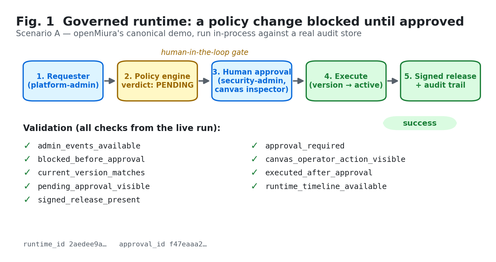
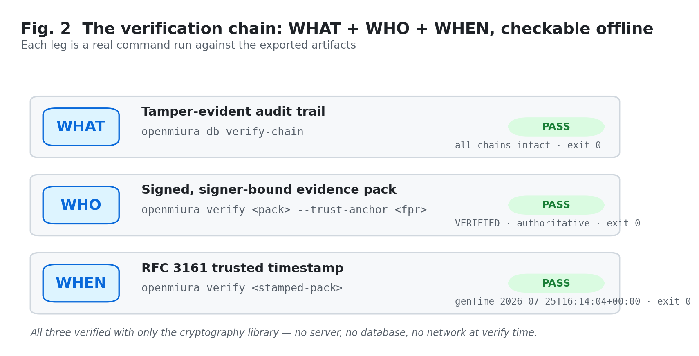
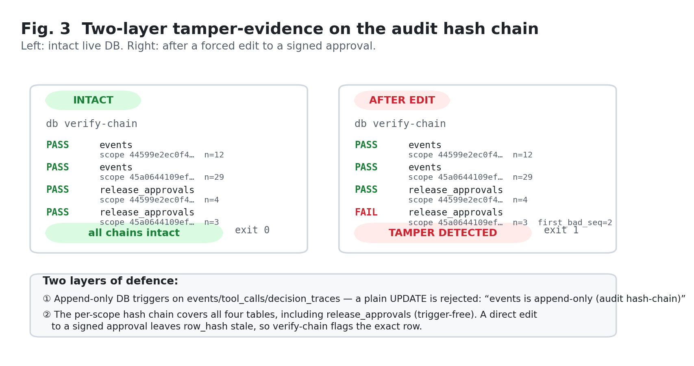
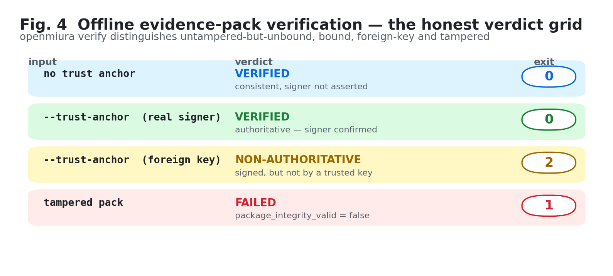
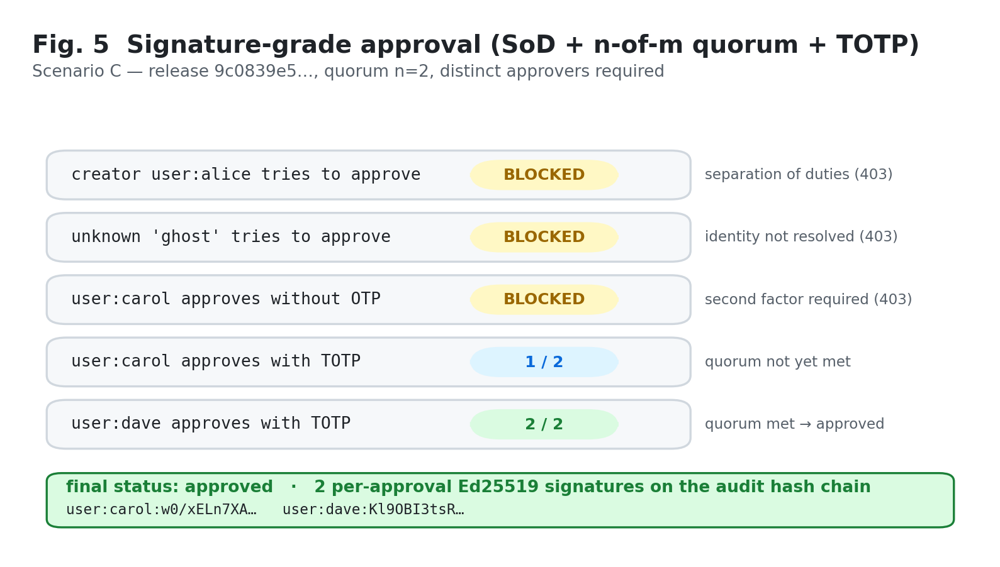
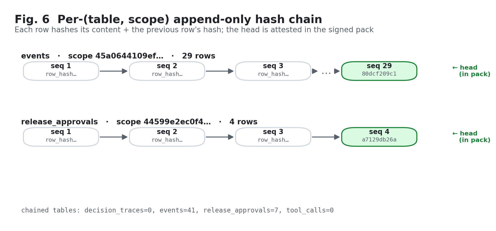
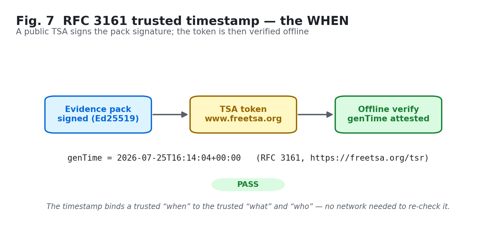

# openMiura in action — a reproducible end-to-end simulation

This directory is the experimental companion to the paper draft
([`../paper_draft.md`](../paper_draft.md)). It runs the **real** openMiura
system end to end, records every result as JSON plus a human-readable
transcript, and renders the paper figures from those results. Nothing here is
mocked or hand-drawn: each figure is generated from the captured output of a
live run, and every command shown is one you can re-run.

> Status: `experimental`, like the rest of the project. The point of this
> simulation is not a performance benchmark; it is a **faithfulness** artifact —
> evidence that the governance and verification claims in the paper hold when
> the code is actually executed.

## How to reproduce

From the repository root, with the package installed (`pip install -e .[dev]`):

```bash
python docs/academic/simulation/run_simulation.py     # scenarios A–D → results/, packs/
python docs/academic/simulation/verify_and_tamper.py  # verification chain + tamper demo
python docs/academic/simulation/make_figures.py       # figures/ (PNG + PDF) from results/
```

The first script leaves a real SQLite database under `workspace/` so the second
can run `openmiura db verify-chain` and the tamper demonstration against it.
All three are deterministic except for wall-clock timestamps and the RFC 3161
token (see *Notes*).

## What is exercised

| Scenario | What it demonstrates | Real system path |
|---|---|---|
| **A. Governed runtime** | A sensitive policy change is *blocked* until a human approves it, then executes, leaving a signed release and an auditable trail. | `openmiura/demo/canonical_case.py`, driven over the in-process FastAPI app |
| **B. NMR pilot** | The synthetic UAL ¹H/¹³C NMR interpretation workflow against the `nmr_interpretation` policy pack — nominal (requires `nmr_reviewer`) and the unknown-impurity escalation (requires `pi_approver`). | `scripts/run_pilot_ual_nmr_demo.py` |
| **C. Signature-grade approval** | Separation of duties (creator/submitter blocked), an *n*-of-*m* quorum of distinct approvers, a single-use **TOTP** second factor, and a per-approval **Ed25519** signature — all on the audit hash chain. | `/admin/releases/*`, `/admin/auth/otp/*` |
| **D. Evidence pack** | A real signed evidence pack exported for offline verification. | `/admin/openclaw/alert-governance/portfolios/*/evidence-package-export` |

The verification driver then runs the auditor's side: `openmiura db
verify-chain`, `openmiura verify` (with and without `--trust-anchor`), a
tampered-pack check, the two-layer database tamper demonstration, and an
RFC 3161 trusted timestamp.

## Results (from the live run)

All values below are taken verbatim from `results/`.

| Check | Command | Result |
|---|---|---|
| Governed flow | scenario A | 9/9 validation checks pass, signed release produced |
| Audit chain (intact) | `openmiura db verify-chain` | all chains intact · **exit 0** |
| Pack (no anchor) | `openmiura verify <pack>` | VERIFIED, consistent, signer not asserted · **exit 0** |
| Pack (real anchor) | `openmiura verify … --trust-anchor <fpr>` | VERIFIED, **authoritative** · **exit 0** |
| Pack (foreign anchor) | `openmiura verify … --trust-anchor <other>` | **NON-AUTHORITATIVE** · **exit 2** |
| Pack (tampered) | `openmiura verify <tampered>` | FAILED (`package_integrity_valid`) · **exit 1** |
| Append-only trigger | `UPDATE events …` | rejected: *“events is append-only (audit hash-chain)”* |
| Chain catches direct edit | `openmiura db verify-chain` after editing a signed approval | **TAMPER DETECTED**, first bad row pinned · **exit 1** |
| Trusted timestamp | `openmiura timestamp … --tsa-url https://freetsa.org/tsr` | RFC 3161 token from www.freetsa.org, verified offline · **exit 0** |

## Figures

Generated by `make_figures.py` into `figures/` (PNG for preview, PDF for LaTeX).

| | |
|---|---|
| **Fig. 1** Governed runtime approval flow |  |
| **Fig. 2** Verification chain: WHAT + WHO + WHEN |  |
| **Fig. 3** Two-layer tamper-evidence (intact vs edited) |  |
| **Fig. 4** Offline evidence-pack verdict grid |  |
| **Fig. 5** Signature-grade approval (SoD + quorum + TOTP) |  |
| **Fig. 6** Per-(table, scope) hash chain |  |
| **Fig. 7** RFC 3161 trusted timestamp |  |

## Artifact map

```
simulation/
  run_simulation.py        # scenarios A–D against a persistent DB
  verify_and_tamper.py     # auditor side: verify-chain, verify, tamper, RFC 3161
  make_figures.py          # figures from results/ (no outcome is hard-coded)
  results/                 # JSON + transcripts captured from the live run
  packs/
    evidence_pack.zip          # real signed pack — `openmiura verify` it
    evidence_pack_stamped.zip  # the same pack with an RFC 3161 timestamp
  figures/                 # fig1..fig7 (.png + .pdf)
  workspace/               # regenerable SQLite DB + config (git-ignored)
```

## Notes (honest limits)

- **Demo keys only.** The evidence-signing seed and the TOTP key-encryption key
  are fixed strings generated for this simulation (`run_simulation.py`). They
  are *not* secrets and must never be reused; a real deployment supplies its own
  via the documented environment variables.
- **RFC 3161 needs a network.** Requesting the timestamp contacts a public
  Timestamping Authority (freetsa.org by default; override with
  `OPENMIURA_SIM_TSA_URL`). *Verifying* an existing token is fully offline. If
  the run has no network, scenario 7 records that it was skipped; the offline
  verification path is covered by `tests/test_cli_verify_timestamp.py` and
  `tests/test_rfc3161_*.py`.
- **No UI screenshots.** openMiura's UI v2 is currently a *design-tokens
  preview*, not yet a functional operations console (auth and the admin surface
  land in later PRs, and it self-labels as such). Presenting it as a live
  console would misrepresent the project's maturity, so the operator surface
  exercised here is the HTTP admin API and the CLI, documented through the
  figures above.
- **Synthetic data only.** The NMR payloads are deterministic placeholders;
  the pilot demonstrates *architecture and governance*, never patient or real
  experimental data.
